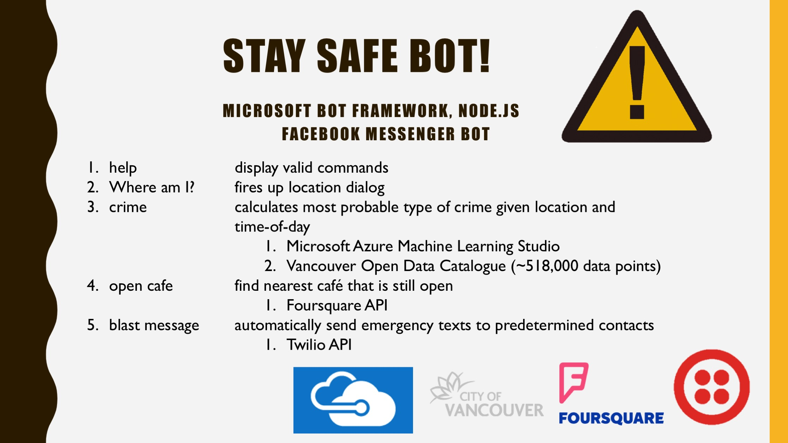

Stay Safe Bot aims to help users have safer journeys from place to place. The five main commands are as follows:
1. help - begin session with Stay Safe Bot
2. Where am I? - starts location dialog
This prompts users to send us a location pin via the Messenger app. Often when crimes happen and police reports have to be made, victims are unable to remember the exact location where they have been attacked, perhaps due to the trauma of the crime or other factors. Thus, this feature acts as a safety net feature in case of situations where crimes unfortunately occur.
3. crime - display most probable crime given location and current time-of-day. Implemented using Microsoft Azure Machine Learning Studio & Open Data Catalogue
Vancouver crime data from 2003 to 2017 was used to create this predictive model. A total of 517,977 rows of crime data were incorporated, 75% for training and 25% for testing. In the future, we could further refine this model by placing different weights on different data entries. For example, entries from more recent years bear greater weight.
4. open cafe - display nearest cafe that is still open. Implemented using Foursquare API
If users want to look for a cafe that is still open or a place with other people for safety, they can easily do so using this command.
5. blast message - send emergency test to pre-determined contacts. Implemented using Twilio API.
